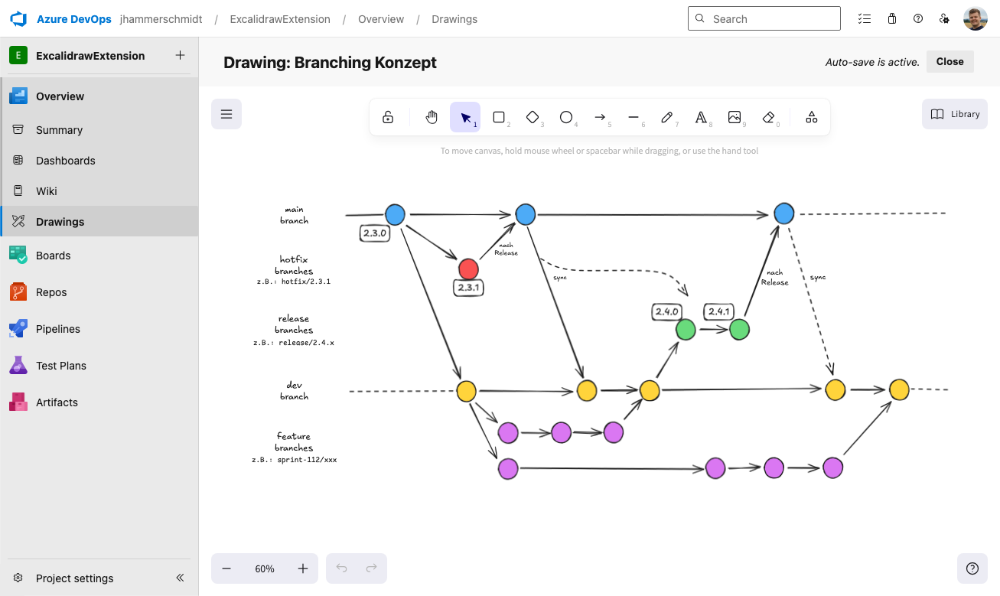

# Azure DevOps Excalidraw Extension

**View and edit Excalidraw drawings in Azure DevOps**

This extension brings [Excalidraw](https://excalidraw.com/) directly into Azure DevOps, so you can create and manage your diagrams, sketches, or architecture visuals right where your code, boards and wiki already live. No more juggling files between tools, everything stays within the same ecosystem.

## 🚀 What it does

The experience is simple and intuitive. Inside Azure DevOps you’ll find a new **Drawings** section where all your Excalidraw files are listed with their names and last updated times, so you always know what’s current. You can create new drawings, rename existing ones, or remove them if they’re no longer needed.

When you open a drawing, the full-featured Excalidraw editor launches inside DevOps. You get shapes, connectors, text, freehand sketching, and image embedding. Changes are saved automatically, so you can focus on drawing instead of hitting save.

If someone else has edited the same drawing in the meantime, you’ll be notified about the version conflict and prompted to reload the latest version.

## 🧰 How to use it

1. Install the extension from the Azure DevOps Marketplace.
2. Open the **Drawings** tab in your project.
3. Create a new drawing or open an existing one.
4. Edit directly in the Excalidraw editor. Your changes will be auto-saved.
5. Close the editor when you’re done, your drawing stays available to you and your team.

## ⚠️ Limitations

Live real-time collaboration (as available on excalidraw.com) is not supported in this extension.

Due to technical constraints of the Azure DevOps Extension Data Service, which does not provide socket-based or real-time communication mechanisms, implementing collaborative editing with end-to-end encryption is not feasible. In addition, maintaining a separate hosted service to enable such functionality is currently outside the scope of this project.

## 🤝 Contributing

Feedback, ideas, and contributions are very welcome. If you discover a bug, have a suggestion, or miss a feature, please open an issue. Pull requests are encouraged, especially for things like:

- Lightweight collaboration improvements
- Linking drawings directly to Work Items
- Improved filtering or search by name/date
- Extending storage options beyond the currently supported shared (account-scoped) mode to also allow private (user-scoped) drawings

## 📄 Data & License

Drawings are stored securely in Azure DevOps via the Extension Data Service. At present, only shared (account-scoped) storage is supported.

See the license file in this repository for details.